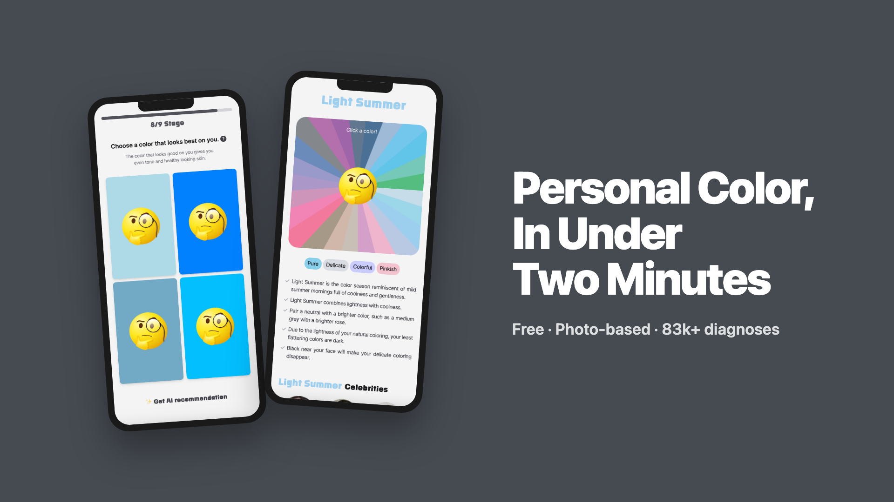
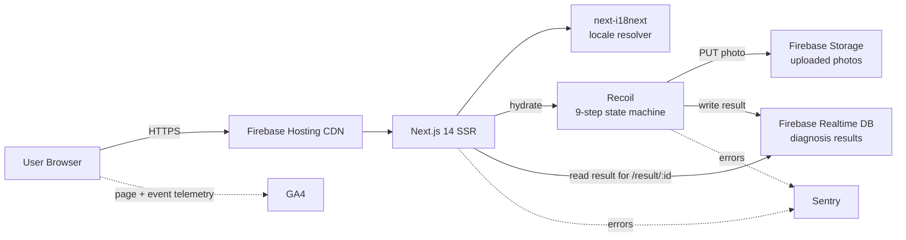
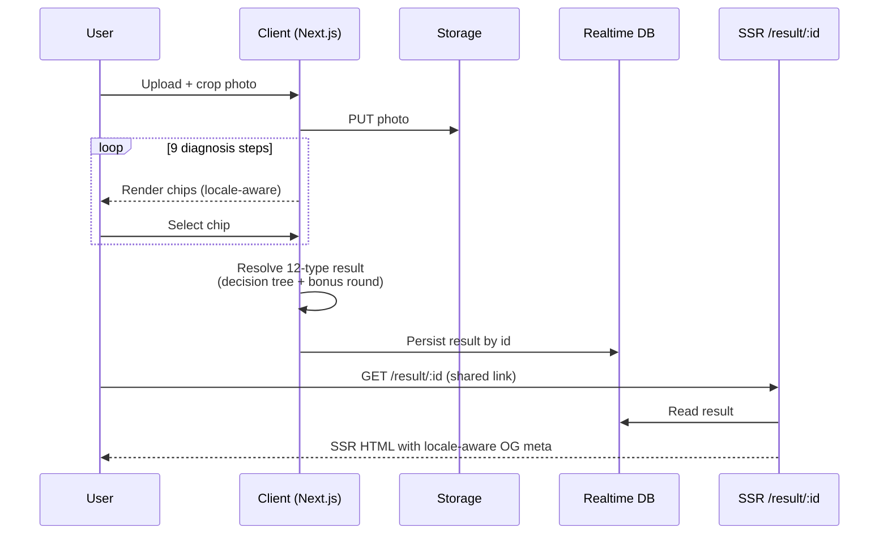

<p align="center">
  <a href="https://omct.web.app/en" rel="noopener" target="_blank"></a>
</p>

# Personal Color Self-Diagnosis Service

A free, photo-based web service that diagnoses a user's personal color in under two minutes. In production since **February 2023**, the service has run **83,000+ diagnoses** for **27,600+ annual active users**, with **83%** of traffic acquired organically through search.

- **Live:** https://omct.web.app/
- **Organization:** https://github.com/SaekKkanDa/OppaManyColorTone
- **Stack:** Next.js (SSR) · TypeScript · Recoil · Firebase (Hosting, Storage, Realtime DB, Firestore, Cloud Functions v2) · OpenAI GPT‑4o Vision · next-i18next · Sentry · GitHub Actions

### Demo

https://github.com/user-attachments/assets/c259747b-bc95-4d82-b200-7acf3f078216

---

## Why This Exists

Professional personal color diagnosis in Korea costs ~₩70,000–150,000 and requires an in-studio appointment. The market lacked a free, accurate, mobile-friendly alternative. We built one — and shipped a product that produced verifiable adoption rather than a portfolio demo.

## Impact

Metrics measured via **Google Analytics 4**, project launch (Feb 2023) → present.

| Metric                                | Value          |
| ------------------------------------- | -------------- |
| Total diagnoses completed             | **83,000+**    |
| Annual active users (AAU)             | **27,600+**    |
| Diagnosis completion rate             | **91.5%**      |
| Organic search share of traffic       | **83%**        |
| Google rank for _"퍼스널컬러 테스트"_ | **First page** |

These numbers were earned, not seeded — there is no paid acquisition. Organic ranking + a high completion rate reflect deliberate work on SEO infrastructure and on the diagnosis flow itself.

---

## My Contributions (Soojin)

| Area                                              | What I owned                                                                                                                                                                                                                                                                                                                                                    |
| ------------------------------------------------- | --------------------------------------------------------------------------------------------------------------------------------------------------------------------------------------------------------------------------------------------------------------------------------------------------------------------------------------------------------------- |
| **Diagnosis algorithm (4 → 12 categories)**       | Designed and implemented the 9-step combinatorial logic that resolves 36 color chips into one of 12 personal color categories, including the bonus-round reevaluation for borderline cases.                                                                                                                                                                     |
| **Internationalization (next-i18next migration)** | Drove the decision (informed by GA4 international traffic signal), evaluated alternatives, and migrated the codebase to an SSR-compatible i18n architecture with namespace splitting. Write-up: [next-i18next migration wiki](<https://github.com/SaekKkanDa/OppaManyColorTone/wiki/4.-%EB%8B%A4%EA%B5%AD%EC%96%B4-%EC%A7%80%EC%9B%90-(next%E2%80%90i18next)>). |
| **SEO metadata layer**                            | Built locale-aware `<head>`, Open Graph, structured data, and sitemap strategy that put the service on Google's first page for the target Korean keyword.                                                                                                                                                                                                       |
| **Taxonomy & content**                            | Expanded the personal color taxonomy from 4 seasonal types to 12 sub-categories, including palettes and per-category descriptive copy used in both the algorithm and the result page.                                                                                                                                                                           |
| **AI color recommendation (GPT‑4o Vision)**       | Designed and shipped an optional recommendation feature for borderline chip choices. Hybrid model routing sends most requests to gpt‑4o‑mini and falls back to gpt‑4o only when confidence is low, keeping per-diagnosis cost near-zero at typical volume. Explicit consent gate, server-authoritative rate limit on Firestore, and quota refunds on failure paths. Deployed to production behind a feature flag pending live-user validation. Details: [ai-color-recommendation.md](./docs/domain/ai-color-recommendation.md). |

Everything below describes the system; this section is the only part claiming ownership.

---

## Algorithm Design — 9-Step Diagnosis for 12 Categories

The original product offered the four classical seasonal categories (spring / summer / fall / winter). I expanded the taxonomy to **12 sub-categories** (each season split along hue, value, and chroma axes), then designed a 9-step diagnosis that resolves to one of those 12 deterministically and quickly.

**Constraints**

- Must run entirely client-side (no inference server, no per-request cost).
- Must finish in ≤ 2 minutes for a casual mobile user.
- Must be deterministic given the same inputs (no ML, no randomness in result).
- Must keep drop-off low across nine sequential decisions.

**Approach**

- **Decision tree over 36 curated chips.** Each of the 9 steps presents a small subset chosen for **maximum information gain** against the _surviving_ candidate set, not the full set. Earlier steps prune broad axes (warm vs. cool); later steps disambiguate sub-categories within a surviving season.
- **No step maps directly to a category.** A step constrains the candidate set; the 12-category result is the intersection after all 9 steps.
- **Bonus reevaluation round.** When the surviving set after 9 steps is non-singleton, a bonus step runs hand-picked chips designed to discriminate between _exactly_ the remaining 2–3 candidates. This was the highest-leverage change for accuracy without lengthening the median session.
- **Chip selection** was iterated against pilot session data, not chosen visually.

**Outcome**

- 12-category resolution at **91.5% completion rate** across 83K+ sessions since launch.
- Zero server-side inference cost. Algorithm ships in the client bundle.

---

## AI Color Recommendation — Hybrid GPT‑4o Vision Routing

The 12-category diagnosis stays fully client-side and deterministic. What it can't do is help a user hesitating between two similarly plausible chips — the rule-based flow has already narrowed the surviving set as much as pre-committed logic allows. AI recommendation is an **optional, per-question assist** for that moment: given the user's uploaded photo and the four current chips, GPT‑4o Vision returns one pick with a short reasoning.

**Constraints**

- Cost per diagnosis cannot rise materially. GPT‑4o is ~15–20× the token cost of GPT‑4o‑mini; a naive "always 4o" approach was a non-starter.
- Explicit consent is required before the photo leaves the client for OpenAI — a distinct data flow from the existing Firebase Storage upload.
- Failures must not silently consume the user's per-session quota (10 calls / session).
- Must ship behind a flag so live rollout is a config change, not a redeploy.
- Base diagnosis must remain fully functional if AI is unavailable — this is an assist, not a replacement.

**Approach**

- **Hybrid model routing.** Requests hit **gpt‑4o‑mini** first. The response includes a self-reported confidence score; only when confidence falls below the threshold does the API re-issue the same request against **gpt‑4o**. Most requests resolve at the mini price point.
- **Prompt engineering against model priors.** GPT‑4o Vision biases toward warm-tone identifications on Korean skin out of the box. The system prompt frames the task as _relative_ comparison across the four options, embeds an undertone-first methodology, and injects a Korean cool-tone prior — tuned against a hand-labeled pilot set before shipping.
- **Server-authoritative rate limiting.** Firestore stores per-session usage. The API refunds the quota on failure paths (no face detected, upstream 5xx, internal error) so a retry after a network blip doesn't double-charge the user.
- **Explicit consent snackbar** on first use, persisted in localStorage. No AI call is made without it.
- **Reproducibility.** `temperature: 0, seed: 42` for stable outputs across identical inputs — regressions in the prompt become detectable in the pilot set.

**Outcome**

- Shipped to production behind `NEXT_PUBLIC_ENABLE_AI_RECOMMEND`. Off by default pending live cost & accuracy validation on real user photos.
- Zod-validated request/response contract with a typed error taxonomy (`NO_FACE_DETECTED`, `RATE_LIMITED`, `AI_UNAVAILABLE`, `INTERNAL_ERROR`). Full architecture and prompt design in [`docs/domain/ai-color-recommendation.md`](./docs/domain/ai-color-recommendation.md).

---

## System Architecture



**Request lifecycle for a diagnosis**



## Key Engineering Decisions

| Decision         | Chose                                          | Rejected                         | Why                                                                                                                                          | Tradeoff accepted                                                      |
| ---------------- | ---------------------------------------------- | -------------------------------- | -------------------------------------------------------------------------------------------------------------------------------------------- | ---------------------------------------------------------------------- |
| Rendering model  | **SSR** (Next.js)                              | SSG, CSR                         | Per-locale meta and per-result OG tags must be crawlable                                                                                     | Cold-start latency on serverless                                       |
| Backend          | **Firebase** (Hosting + Storage + Realtime DB) | Self-hosted Node + Postgres      | Zero ops, free-tier headroom at our traffic, fast iteration with a small team                                                                | Vendor lock-in; fan-out and egress cost would dominate at higher scale |
| Client state     | **Recoil**                                     | Redux, Zustand                   | Atom-level granularity fits a 9-step flow where each step owns local state but several derived selectors depend on the running candidate set | Recoil's maintenance trajectory is uncertain                           |
| i18n             | **next-i18next**                               | next-intl, custom                | Mature SSR story, namespace splitting that keeps per-route payloads small, drop-in for the existing Pages-router code                        | Heavier configuration than next-intl                                   |
| Result inference | **Client-side decision tree**                  | Server-side classifier, ML model | Deterministic, free to run, no PII leaves the device beyond the photo the user already uploaded                                              | No room for personalization based on cross-session data                |
| AI recommend routing | **Hybrid** (gpt‑4o‑mini → gpt‑4o on low confidence) | Always gpt‑4o, or single-model gpt‑4o‑mini | gpt‑4o alone is ~15–20× the token cost; mini alone leaves borderline cases undecided                                                        | Extra hop of latency on the (uncommon) fallback path                   |

## Technical Challenges & Learnings

### 1. Designing the 9-step state machine

The diagnosis is a constrained search over 12 candidate categories using 9 binary/ternary signals. Two non-obvious problems surfaced:

- **Step ordering matters.** Putting a high-information-gain step too early collapses the candidate set, leaving later steps redundant. Putting it too late means later steps waste user attention on a question whose answer is already implied. I ordered steps to keep entropy of the surviving set roughly even across the session.
- **Borderline cases hurt accuracy more than length hurts drop-off.** Adding a bonus reevaluation round (only triggered when the surviving set is non-singleton) traded ~10 seconds of median session time on borderline users for a measurable accuracy gain on the population the original 9 steps couldn't disambiguate.

**Learning.** Treat the diagnosis as a decision tree against a _surviving_ candidate set, not a classifier mapping (chip → category). The chip selection problem then becomes information-gain on the live subset, which is a much sharper formulation.

### 2. Internationalization as a data-driven product decision

GA4 surfaced a non-trivial fraction of overseas sessions early in the service's life. That signal — not a roadmap meeting — is what motivated the i18n work. I evaluated **next-intl** and **next-i18next**, chose **next-i18next** for its mature SSR story (we needed locale-aware `<head>` for SEO), and migrated the existing strings to namespaced JSON split by route. The migration shipped without regressions because the existing Pages-router structure mapped cleanly onto next-i18next's namespace model.

**Learning.** "Should we internationalize?" is a product question that should be answered with traffic data. The library choice is downstream of how you render (SSR vs. CSR), not the other way around.

### 3. SEO to Google's first page

Ranking a free Korean-language service on Google's first page for _"퍼스널컬러 테스트"_ required treating SEO as engineering, not marketing:

- **Per-locale `<head>` and Open Graph** generated at SSR time so each locale is independently crawlable.
- **Structured data** so Google understands the page as a tool, not an article.
- **Sitemap + robots** aligned to the i18n routing scheme.
- **Result pages are SSR-rendered** by `/result/[id]` so shared links carry crawlable meta — important because organic traffic is largely word-of-mouth shares.

The result — 83% of inbound traffic now arrives via organic search — is the single largest contributor to our zero-CAC growth model.

### 4. Operating in production for 3+ years on Firebase

Running a real service exposed tradeoffs that aren't obvious from a tutorial:

- **Firebase Storage egress** is the cost variable that scales fastest with usage; cache control and image optimization are not optional.
- **Realtime DB fan-out** would not survive a 10× scale event without restructuring the result schema. We have not hit that ceiling, but I now read every "use Firebase" decision through that lens.
- **Sentry release tracking** keeps post-deploy regressions in the right blast radius; without it, a 91.5% completion rate is impossible to maintain because regressions look identical to user drop-off in GA4 alone.

## Tech Stack

| Layer             | Choice                                                     |
| ----------------- | ---------------------------------------------------------- |
| Framework         | Next.js 14 (Pages router, SSR)                             |
| Language          | TypeScript                                                 |
| Styling           | styled-components                                          |
| State             | Recoil                                                     |
| Hosting / Backend | Firebase Hosting, Storage, Realtime DB, Firestore, Cloud Functions v2 |
| AI                | OpenAI GPT‑4o / GPT‑4o‑mini (Vision), hybrid routing       |
| i18n              | next-i18next                                               |
| Monitoring        | Sentry (errors) + GA4 (product)                            |
| CI/CD             | GitHub Actions → Firebase CLI                              |
| Misc              | Spline (3D landing), html2canvas (result share), Kakao SDK |

## Deployment & Observability

- **Branch-gated deploys.** Pushes to `production` trigger a GitHub Actions pipeline that injects environment secrets, builds with the Next.js production target, and deploys to the `live` Firebase Hosting channel. `develop` and feature branches do not touch the live domain.
- **Error budget.** All routes report to Sentry with release tags. Per-route error rate is the gate for shipping the next change.
- **Product telemetry.** GA4 captures every step transition in the 9-step flow so completion rate and step-level drop-off are first-class metrics, not derived guesses.

## Local Development

```bash
nvm use      # pin Node version from .nvmrc
yarn         # install dependencies
yarn dev     # start Next.js dev server

yarn build   # production build
yarn lint    # eslint
```

## Documentation

- [Error Handling Design](https://github.com/SaekKkanDa/OppaManyColorTone/wiki/1.-%EC%97%90%EB%9F%AC-%ED%95%B8%EB%93%A4%EB%A7%81-%EB%94%94%EC%9E%90%EC%9D%B8)
- [Deployment Automation with GitHub Actions](https://github.com/SaekKkanDa/OppaManyColorTone/wiki/2.-Github-Actions%EC%9D%84-%ED%99%9C%EC%9A%A9%ED%95%98%EC%97%AC-%EB%B0%B0%ED%8F%AC-%EC%9E%90%EB%8F%99%ED%99%94)
- [Project Folder Structure](https://github.com/SaekKkanDa/OppaManyColorTone/wiki/3.-OMCT-%ED%8F%B4%EB%8D%94-%EA%B5%AC%EC%A1%B0)
- [Internationalization (next-i18next)](./docs/en/i18n-next-i18next.md)
- [AI Color Recommendation — architecture, prompt, routing](./docs/en/ai-color-recommendation.md)
- [Personal Color Algorithm — 12-type diagnosis internals](./docs/en/personal-color-algorithm.md)

---

## Team

Built with team **SaekKkanDa**. My contributions are itemized above; collaborators below owned the areas not listed in that section.

<!-- ALL-CONTRIBUTORS-LIST:START - Do not remove or modify this section -->
<table>
  <tbody>
    <tr>
      <td align="center" valign="top">
        <a href="https://github.com/soojjung">
          
          <br />
          <sub>
            <b>Soojin</b>
          </sub>
        </a>
        <br />
      </td>
      <td align="center" valign="top">
        <a href="https://github.com/seoltang">
          
          <br />
          <sub>
            <b>Seoltang</b>
          </sub>
        </a>
        <br />
      </td>
      <td align="center" valign="top">
        <a href="https://github.com/zwonkim">
          
          <br />
          <sub>
            <b>Coco</b>
          </sub>
        </a>
        <br />
      </td>
      <td align="center" valign="top">
        <a href="https://github.com/hyeongjun3">
          
          <br />
          <sub>
            <b>Jun</b>
          </sub>
        </a>
        <br />
      </td>
      <td align="center" valign="top">
        <a href="https://github.com/jjsk109">
          
          <br />
          <sub>
            <b>Nick</b>
          </sub>
        </a>
        <br />
      </td>
    </tr>
  </tbody>
</table>
<!-- ALL-CONTRIBUTORS-LIST:END -->
