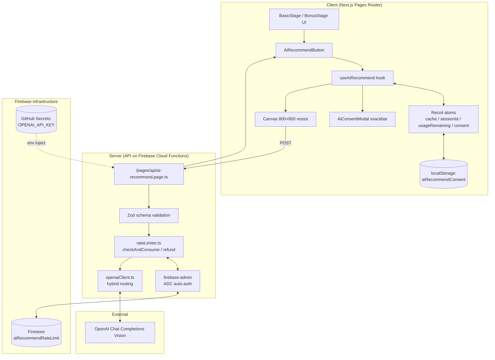
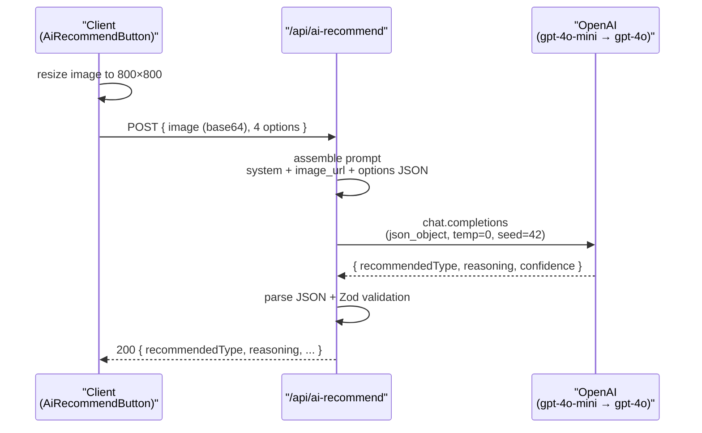

# AI Color Recommendation

An **optional**, per-question assist during the Basic Stage (9 rounds) and the Bonus Stage. When a user hesitates between the 4 chip options, they can request an **OpenAI GPT‑4o Vision**–backed recommendation. **Hybrid routing** (`gpt-4o-mini` first, `gpt-4o` fallback) balances cost and accuracy.

- **Created**: 2026-07-02 (design draft)
- **Last updated**: 2026-07-03 (implementation shipped, observations folded in)
- **Status**: Deployed to production, feature flag OFF pending live validation.

> The end-to-end user journey is documented in the [project README](../../README.md). This document scopes down to the AI recommendation feature only.

---

## 0. Implementation status & deltas vs. design

### 0.1 Current deployment state

| Item | Value |
| ---- | ----- |
| Production deploy | ✅ Complete (`production` branch) |
| Feature flag | `NEXT_PUBLIC_ENABLE_AI_RECOMMEND='false'` (initial: OFF) |
| Exposure surface | Basic Stage 9 questions + Bonus Stage 1 question (10 max per session) |
| Turn-on procedure | GitHub Variables → `ENABLE_AI_RECOMMEND='true'` → redeploy |

### 0.2 Design → actual delta

| Area | Design (v0) | Actual implementation |
| ---- | ----------- | --------------------- |
| Rate-limit storage | RTDB | **Firestore + firebase-admin** (unified with the existing `omctDb`) |
| API route path | `ai-recommend.ts` | **`ai-recommend.page.ts`** (uses `pageExtensions`) |
| Consent | Implicit | **Explicit consent modal** (§4.2) |
| Exposure | Basic Stage 9 only | **Basic Stage 9 + Bonus Stage 1** |
| Option schema | `{type, color, name}` | `{type, color, name?, season, tone}` |
| Reproducibility | `temperature: 0.3` | `temperature: 0`, `seed: 42` |
| Failure quota | Consumed | **Refunded** |
| Prompt | Simple instruction | **Relative-comparison framing + undertone methodology + warm-bias correction + Korean cool prior + tone-axis visual traits** |
| UI label | "AI recommendation" | "AI's pick from these 4" |

Rationale for each change lives in the linked section or the corresponding PR commit.

---

## 1. Architecture

### 1.1 Component diagram



### 1.2 Deployment architecture

- **Static assets**: Firebase Hosting (existing)
- **SSR / API routes**: Firebase Cloud Functions v2 (`webframeworks` experiment, Node 20 runtime)
- **API key storage**: GitHub Actions Secrets → injected into `.env` at deploy time
- **Rate-limit storage**: Firestore `aiRecommendRateLimit` collection (`firebase-admin` server SDK)
- **Feature flag**: GitHub Actions Variables → `NEXT_PUBLIC_ENABLE_AI_RECOMMEND`

---

## 2. API contract

### Endpoint

```
POST /api/ai-recommend
```

### Request

```ts
type AiRecommendRequest = {
  imageBase64: string;   // data:image/jpeg;base64,... (5MB body limit)
  stageNum: number;      // 0-9 (9 is the Bonus Stage)
  sessionId: string;     // client-generated UUID
  options: Array<{
    type: ColorType;     // 'springwarm' | 'summercool' | ...
    color: string;       // '#ff6448'
    name?: string;
    season: 'spring' | 'summer' | 'autumn' | 'winter';
    tone: 'warm' | 'cool' | 'bright' | 'mute' | 'light' | 'deep';
  }>;
};
```

### Response

**200 OK**

```ts
type AiRecommendResponse = {
  recommendedType: ColorType;
  reasoning: string;         // 1-2 sentences (relative-comparison framing)
  confidence: number;        // 0.0 - 1.0
  usageRemaining: number;
  source: 'mini' | 'full';
};
```

**Errors**

```ts
type AiRecommendError = {
  error: 'INVALID_INPUT'        // 400
       | 'NO_FACE_DETECTED'     // 422 (refunds quota)
       | 'RATE_LIMITED'         // 429 (Retry-After header)
       | 'AI_UNAVAILABLE'       // 502 (refunds quota)
       | 'INTERNAL_ERROR';      // 500 (refunds quota)
  message: string;
  retryAfterSeconds?: number;
};
```

### Prompt engineering strategy

To keep the Vision model from acting as a final diagnostic AND to make it choose carefully among 4 options, the `SYSTEM_PROMPT` bakes in the following rules explicitly.

**1. Relative-comparison framing (prevent overreach)**

Redefine the task from "diagnose their tone" to "pick the best fit among these 4."

- Prompt states: `You are NOT diagnosing their final personal color type — the 4 options are a limited subset.`
- The `reasoning` output MUST use relative phrasing such as "among these 4" / "of the four options."
- Diagnostic phrasing like "You are a winter cool tone" / "Your personal color is..." is registered as **banned**.

```
GOOD: "Among the four options, this one makes the skin look clearest and defines the face outline."
BAD:  "You are a winter cool tone, and this color suits you best."
```

**2. Structured metadata on each option**

Instead of only passing string labels (`springwarm`, etc.), each option ships with explicit `season` and `tone` fields. This removes the AI's burden of parsing undertone from a compound label and gives it structured signal directly.

```json
{ "type": "summerlight", "color": "#f7cdd0", "season": "summer", "tone": "light" }
```

The prompt states the season-to-undertone mapping explicitly: `spring/autumn imply WARM undertone; summer/winter imply COOL undertone`.

**3. Undertone methodology (standardize the reasoning)**

Instead of "just pick what looks right," the prompt names **specific observation regions**:

- **Shadow zones**: back of the neck, behind the ears, under the jaw, temples. Yellow / golden / peach → warm. Pink / rose / blue → cool.
- **Adjacent-tone harmony**: warm should sit naturally with ivory/beige; cool should sit naturally with grey/pink.
- **Wrist vein color** (if visible): green → warm; blue-purple → cool.

**4. Warm-bias correction + Korean cool prior**

Two bias layers stack on top of each other and push identifications toward warm:

- **The photo itself is warm-shifted**: camera auto-white-balance, indoor lighting, beauty filters, and JPEG compression together tend to lay a yellow cast on skin.
- **The Vision model has a warm prior**: its training data was largely photos suffering the above distortions, so "face = slightly warm" is baked in.

The prompt names both biases and **forces borderline cases to lean cool**:

- `Photo lighting / camera white-balance / JPEG compression frequently shift skin toward yellow/warm`
- `In the Korean population, COOL undertones are demographically MORE common`
- `When ambiguous or borderline between warm and cool, ALWAYS default to the cool option`
- `Only pick a warm-season option when the warm undertone is clearly and unmistakably visible`

After this tuning, cases where Light Summer users were being misclassified as Light Spring improved.

**5. Tone-axis visual traits (light / mute / bright / deep)**

Each tone label is anchored to a specific visual impression the model should look for on the face. Light vs. Mute in particular is a frequent misclassification and gets its own rule set:

- **LIGHT**: skin is luminous, translucent, dewy; pastel clarity.
- **MUTE**: skin is matte, soft-powdered, low-contrast; hazy quality.
- **BRIGHT**: crisp definition in eyes/hair; face can carry vivid colors.
- **DEEP**: strong contrast between skin and eyes/hair; deep colors anchor rather than overpower.

**6. Tone-axis bias correction**

Photo artifacts (low light, compression) tend to make skin look more mute than it actually is:

- `Borderline light vs mute → prefer LIGHT (photo artifacts more often ADD muteness than remove it)`

**7. Reproducibility parameters**

- `temperature: 0` — no sampling randomness.
- `seed: 42` — best-effort reproducibility.
- Same image + same options should yield the same response, so prompt tuning is observable.

**8. Forced JSON response + schema validation**

- `response_format: { type: 'json_object' }` forces JSON output.
- The server parses & validates via Zod (`aiOpenaiResponseSchema`).
- Cross-check: the returned `recommendedType` must be one of the 4 options that were sent in (guards against hallucination).
- Parse failure → `INVALID_AI_RESPONSE`; no face → `NONE` (mapped to `NO_FACE_DETECTED`, quota refunded).

**Full text**: `src/utils/aiRecommend/prompt.ts` (`SYSTEM_PROMPT` constant).

---

### Hybrid routing

1. **`gpt-4o-mini` is called first** (cheap, handles the majority of cases).
2. If `confidence < CONFIDENCE_THRESHOLD (= 0.7)`, escalate to `gpt-4o`.
3. If the `gpt-4o` call fails, fall back to the mini response as-is (`source: 'mini'` retained).
4. `recommendedType === 'NONE'` short-circuits to `NO_FACE_DETECTED` (no escalation) and refunds the quota.

Routing lives in: `src/utils/aiRecommend/openaiClient.ts` (`getRecommendation`).

Shared call parameters: `response_format: json_object`, `max_tokens: 200`, `temperature: 0`, `seed: 42`, `image_url.detail: 'low'`.

---

## 3. UI / UX

### States

| State | Trigger | Display |
| ----- | ------- | ------- |
| `idle` | Initial | "✨ Get AI recommendation" (text link) |
| `loading` | In flight | Spinner + "AI is analyzing..." (typical 2–7 s) |
| `success` | 200 or cache hit | Pulse-highlight on the picked option + banner: "AI's pick from these 4: [reason]" |
| `error` | Failure | "Recommendation is unavailable right now" or "We can't see the face clearly" + retry link |
| `rateLimited` | 429 | Disabled + "Daily quota exhausted" |
| `disabled` | Feature flag OFF | Not rendered |

### Highlight & accessibility

- Pulse effect via CSS `box-shadow` + `keyframes`.
- Respects `prefers-reduced-motion`: falls back to a static outline when reduced motion is requested.

### i18n

`aiRecommend.*` keys exist in `public/locales/{ko,en}/common.json`.

---

## 4. Privacy & consent

### 4.1 Data handling principles

- **Minimal collection**: face photo only. No PII.
- **Immediate discard**: image is dropped from memory after the response returns. Not written to files or logs.
- **IP storage**: SHA-256 hash, first 32 characters only (used for rate limiting; raw IP is never stored).
- **OpenAI policy**: API data is not used for training; a 30-day abuse-monitoring log may exist on OpenAI's side.

### 4.2 Explicit consent modal

The original design used implicit consent. Because the app has no dedicated privacy-policy page, the implementation switched to an **explicit consent modal**.

- **Component**: `AiConsentModal.tsx` (same snackbar visual language as the share modal).
- **Trigger**: first click on the AI recommend button. If `consent !== 'granted'`, the request is deferred until consent is granted.
- **Storage**: `aiRecommendConsentState` Recoil atom with `localStorageEffect`. No re-consent on return visits.
- **Reject flow**: no quota consumed; a subsequent click re-opens the modal (user can reconsider).
- **Modal copy**: purpose of use / what is transmitted / who receives it (OpenAI gpt-4o-mini/4o) / retention (immediate discard) + note on OpenAI's policy + reject guidance.

**Follow-up**: once a proper `/privacy` page exists, this modal can be replaced with a link to it.

---

## 5. Cost & rate limits

### 5.1 Per-call cost

- Vision `detail: 'low'`: ~85 tokens per image.
- Per request total: ~455 tokens (system + image + options + output).
- **`mini` only**: ~$0.0001 (~₩0.15)
- **`full` only**: ~$0.0015 (~₩2)
- **Hybrid average** (assuming 20% fallback rate): **~$0.0004** (~₩0.6)

### 5.2 Rate limits

Firestore-backed counter. `refund` reverses a consumed slot on failure. Localhost bypass.

**Three tiers**, each with a different purpose:

| Tier | Cap | Reset | Purpose |
| ---- | --- | ----- | ------- |
| Session | 10 | Page reload | Enough for one full diagnosis (Basic 9 + Bonus 1) |
| IP | 30 / day | UTC midnight | Real-world abuse & cost ceiling (~3 full sessions) |
| Monthly | $30 | OpenAI dashboard alert | Last-resort kill switch → flip the feature flag OFF |

- **Session = 10** intentionally equals "every point at which a user could theoretically request AI help in one session." `sessionId` lives in Recoil in-memory and resets on refresh, so session limits are advisory; the IP tier is the actual abuse defense.
- Failed requests are refunded, so retries after a network blip don't double-consume.
- Localhost (`127.0.0.1` / `::1` / `localhost` / `unknown`) is not counted.
- On IP overflow: 429 + `Retry-After` header with seconds until UTC midnight.

### 5.3 Monthly budget

- **OpenAI dashboard hard limit**: **$30 / month**.
- On overflow, immediately redeploy with `NEXT_PUBLIC_ENABLE_AI_RECOMMEND='false'`.
- Softer knobs before pulling the flag: lower `CONFIDENCE_THRESHOLD` (0.7 → 0.5) to reduce fallback rate, or lower the per-session cap.

### 5.4 Response times

| Scenario | p50 → p95 |
| -------- | --------- |
| Resolved by `mini` only (~80%) | 1.5 → 3 s |
| `mini` → `full` fallback (~20%) | 3.5 → 7 s |

A loading UI is mandatory. Worst case (fallback path) is up to 7 s.

---

## 6. Risks & extensions

### 6.1 Risk / mitigation

| Risk | Mitigation |
| ---- | ---------- |
| OpenAI outage | Hybrid fallback + refund on failure + UI retry |
| Non-JSON / schema-invalid response | `json_object` forced + Zod validation + cross-check `recommendedType` against the sent options |
| Cost blow-up | Session/IP counters + cache + $30 / month hard cap + flag-OFF instant rollback |
| Abuse | IP-based limiting + SHA-256 hashing. Turnstile is the follow-up if needed. |
| No face in image | Prompt instructs `NONE` → 422 mapping + refund |
| Over-reliance on AI | Relative-comparison framing + UI label "AI's pick from these 4" |
| Bias (warm-bias, light↔mute confusion) | Undertone methodology + Korean cool prior + tone-axis visual traits |
| Retry double-charge | Refund on failure |

### 6.2 Follow-ups

- **Dedicated `/privacy` page**: replace the snackbar consent with a page link.
- **Bonus Stage AI review**: if real-world usage shows low utility, remove the Bonus Stage AI button.
- **User-pick vs AI-pick stats**: opt-in anonymous aggregation to surface an agreement rate.
- **On-device face detection**: block server calls on face-less images before they hit the API.
- **AI comment on final result**: an "AI's read of you" paragraph on the result page.

---

## 7. Related files

### Server

- `src/pages/api/ai-recommend.page.ts` — API route (POST handler)
- `src/utils/aiRecommend/schema.ts` — Zod schemas
- `src/utils/aiRecommend/prompt.ts` — `SYSTEM_PROMPT` + `buildUserText`
- `src/utils/aiRecommend/openaiClient.ts` — hybrid routing + `CONFIDENCE_THRESHOLD`
- `src/utils/aiRecommend/rateLimiter.ts` — `checkAndConsume`, `refund`, caps, localhost bypass
- `src/utils/aiRecommend/adminDb.ts` — firebase-admin init (ADC / `FIREBASE_SERVICE_ACCOUNT_JSON`)
- `src/utils/aiRecommend/typeMeta.ts` — `ColorType → {season, tone}` mapping

### Client

- `src/hooks/useAiRecommend.ts` — request hook, consent gate, state machine
- `src/components/AiRecommend/index.tsx` — `AiRecommendButton`
- `src/components/AiRecommend/AiConsentModal.tsx` + `consentStyle.ts` — consent modal
- `src/components/AiRecommend/style.ts` — button styling
- `src/recoil/aiRecommend.ts` — 4 atoms (cache / sessionId / usageRemaining / consent)
- `src/utils/imageResize.ts` — Canvas resize

### Integration points

- `src/pages/choice-color/BasicStage/index.tsx` — pulse highlight + button
- `src/pages/choice-color/BonusStage/index.tsx` — button (`stageNum=9`)

### Config / translations / CI

- `public/locales/{ko,en}/common.json` — `aiRecommend.*` keys
- `.env.example` — env-var documentation
- `.github/workflows/firebase-hosting-merge.yml` — secret injection
- `next.config.js` — `pageExtensions: ['page.tsx', 'page.ts']`, `outputFileTracingIncludes`
- `tsconfig.json` — `@Root/*` alias

### Validation tooling

- `scripts/ai-recommend-check.ts` — local CLI (`yarn ai-recommend:check <image>`) to manually compare `mini` and `full` responses.

### References

- [personal-color-algorithm.md](./personal-color-algorithm.md) — 12-type domain doc
- OpenAI Vision: https://platform.openai.com/docs/guides/vision
- Firebase webframeworks: https://firebase.google.com/docs/hosting/frameworks/nextjs

---

## 8. Core AI-recommend flow

### 8.1 Request → OpenAI → response



Key details:

- Prompt text & options serialization: `src/utils/aiRecommend/prompt.ts`
- Hybrid routing (mini → confidence → full): `src/utils/aiRecommend/openaiClient.ts` (`getRecommendation`)
- Rate limit & refund: `src/utils/aiRecommend/rateLimiter.ts`
- Consent gate: §4.2

### 8.2 Observability

Once the flag is turned on and real traffic accumulates, watch:

- **Fallback rate** = `full` calls / total calls. If it exceeds 20%, revisit the prompt.
- **Confidence histogram**: distribution of `mini` responses. Grounds for retuning the 0.7 threshold.
- **Refund rate**: if dominated by `AI_UNAVAILABLE`, audit OpenAI account / key state.
- **Consent-reject rate**: >30% means the modal copy needs work.
- **Monthly spend**: OpenAI dashboard alert at $30 / month. Flip the flag OFF if crossed.
